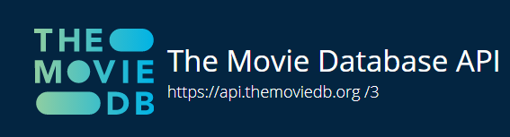
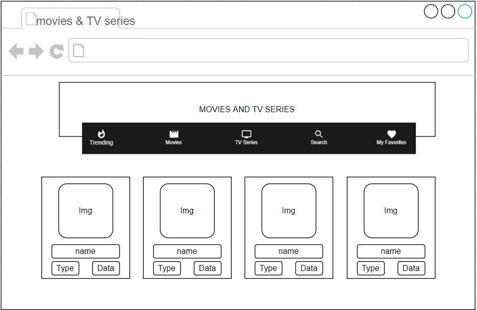
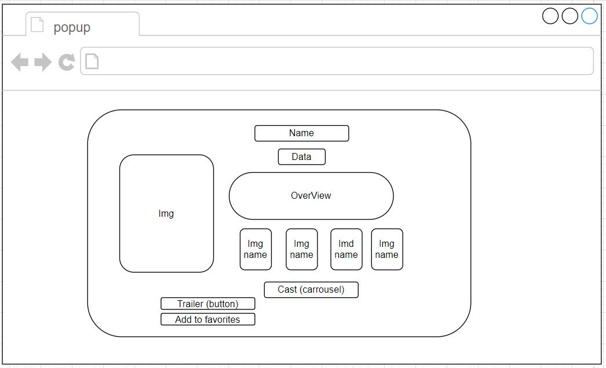

# MOVIES AND TV SERIES

## General information about my site

* netlify link: [MOVIES AND TV SERIES](https://movies-and-tv-series.netlify.app/ "https:/movies-and-tv-series.netlify.app/")

* Technologies Used:
    * HTML
    * CSS
    * React.js
    * React-Ruter
    * Purely functional components ( useState, useEffect)
    * Material-UI
    * Axios & web API's

* API: 

    * ;
    * [API](https://developers.themoviedb.org/3/getting-started/introduction "https://developers.themoviedb.org/3/getting-started/introduction")

* Schema:
    * 
    * PopUp : 
      

